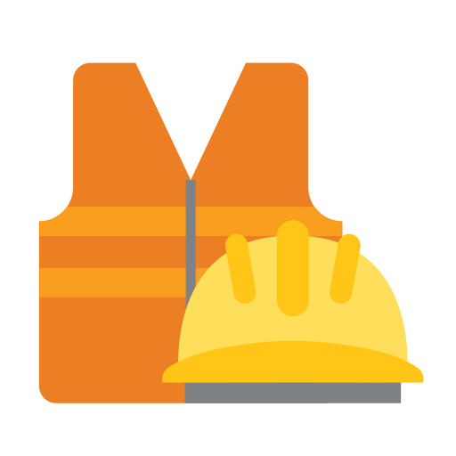

<h1 style="font-size: 2.0em;"> Table of Contents </h1> 

- [🐍 Python Projects](#-python-projects)
  - [🧬 Author-Curated Datasets](#-author-curated-datasets)
  - [📊 Data Analysis](#-data-analysis)
  - [💻 Python Development](#-python-development)

 

# 🐍 Python Projects

## 🧬 Author-Curated Datasets

| Dataset | Area | Description | Link(s) |
|:-:|:-:|:-:|:--|
|&nbsp;  
  <a href="https://www.kaggle.com/datasets/lhucastenorio/gas-separation-membranes-performances-2009-2022" target="_blank"><strong>  Gas separation membranes performances 2009-2022</strong></a>
 This database decribes various types of membranes and permeating gases in gas separation context.  &nbsp;| Materials Optimization | A curated database was built for gas separation membranes, comprising **1672 records** collected from over 40 bibliographic sources. In addition to an in-depth exploratory data analysis (EDA), several machine learning models (**Random Forest**, **SVM**, and **ANN**) were applied to predict the performance of these materials. To enhance predictive accuracy, data engineering techniques were used to impute missing values via a KNN-based approach. Beyond offering a unified and comprehensive dataset, this project enabled the construction of a predictive model with residual errors **50% lower than existing models in the literature**.    Most importantly, a common factor across different materials was identified, allowing the development of a **generalized model** capable of handling a heterogeneous range of membrane materials. |&nbsp;&nbsp;&nbsp;&nbsp;&nbsp;&nbsp;&nbsp;&nbsp;&nbsp;&nbsp;&nbsp;&nbsp;&nbsp;&nbsp;&nbsp;&nbsp;&nbsp;&nbsp;&nbsp;&nbsp;&nbsp;&nbsp;&nbsp;&nbsp;&nbsp;&nbsp;&nbsp;&nbsp;&nbsp;&nbsp;&nbsp;&nbsp;&nbsp;&nbsp;&nbsp;&nbsp;&nbsp;&nbsp;&nbsp;&nbsp;&nbsp;&nbsp;&nbsp;&nbsp;&nbsp;&nbsp;&nbsp;&nbsp;&nbsp;&nbsp;&nbsp;&nbsp;&nbsp;&nbsp;&nbsp;&nbsp;&nbsp;&nbsp;&nbsp;&nbsp;&nbsp;&nbsp;  ⇨ [2023 \| Master’s thesis](https://repositorio.ufu.br/bitstream/123456789/39065/1/aprendizado_de_maquina_aplicado.pdf)   ⇨ 2021-2023 \| Codes:   &nbsp;&nbsp;&nbsp;&nbsp;▸ [EDA](https://www.kaggle.com/code/lhucastenorio/ch4-databank-modeling-eda)   &nbsp;&nbsp;&nbsp;&nbsp;▸ [Values Imputation](https://www.kaggle.com/code/lhucastenorio/ch4-databank-modeling-values-imputation)   &nbsp;&nbsp;&nbsp;&nbsp;▸ [Random Forests model](https://www.kaggle.com/code/lhucastenorio/ch4-databank-modeling-random-forests)   &nbsp;&nbsp;&nbsp;&nbsp;▸ [SVR model](https://www.kaggle.com/code/lhucastenorio/ch4-databank-modeling-svm)   &nbsp;&nbsp;&nbsp;&nbsp;▸ [Artificial Neural Network model](https://www.kaggle.com/code/lhucastenorio/ch4-databank-modeling-neural-network)   ⇨ [2024 \| Article publication](https://doi.org/10.55905/oelv22n3-164)   &nbsp;|
|&nbsp;  
  <a href="https://www.kaggle.com/datasets/lhucastenorio/industrial-accidents-brazil-from-news-2011-2023" target="_blank"><strong>  Industrial Accidents Brazil from News 2011-2023</strong></a>
 This database refers to work accidents in Brazilian industries using press cover  &nbsp;| Occupational Engineering and Safety |  This database was built using news articles from the G1 portal (g1.globo.com) to survey workplace accidents in Brazil between 2011 and 2023. In total, 72 news items related to workplace accidents were recorded, allowing for the extraction of several insights related to these events. |&nbsp;  ⇨ [2023 \| What Does the News Say About Industrial Safety?](https://github.com/tenoriolms/dataset_industrial_accidents_BR)  &nbsp;|
|&nbsp;  
  <a href="https://www.kaggle.com/datasets/lhucastenorio/oncology-treatment-datasus-brazil-20132023" target="_blank"><strong>  Oncology Treatment DataSUS 2013–2023</strong></a>
 This dataset includes anonymized records of cancer diagnoses and treatments performed through Brazil's public health system (SUS).  &nbsp;| Public Health and Applied Epidemiology | This dataset enables analyses related to **treatment delays**, **healthcare access**, **regional disparities**, and **compliance** with national cancer care policies. The data supports public health research, epidemiological studies, and the development of data-driven healthcare strategies. |&nbsp;  🚧 *Building something great here* 🚧  &nbsp;|

## 📊 Data Analysis

| Dataset | Area | Description | Link(s) |
|:-:|:-:|:-:|:--|
|&nbsp;  
  <a href="https://www.kaggle.com/datasets/adilshamim8/social-media-addiction-vs-relationships" target="_blank"><strong>  Students' Social Media Addiction</strong></a>
 This dataset contains anonymized records of students’ social‐media behaviors and related life outcomes.  &nbsp;| Social Science and Psychology | By analyzing the distribution of variables and their relationships within the dataset, it was possible to uncover several key aspects of digital dependency among students from around the world. The findings reveal that factors such as **sleep duration**, **daily usage time**, **mental health**, and **frequency of online conflicts** are strongly associated with social media addiction, which in turn negatively **impacts academic performance**. Furthermore, **women and younger individuals** appear to be more vulnerable to this dependency. Among the platforms, **Instagram**, **TikTok**, and **WhatsApp** stood out as the most addictive. Interestingly, relationship status showed no significant correlation with social media addiction. |&nbsp;&nbsp;&nbsp;&nbsp;&nbsp;&nbsp;&nbsp;&nbsp;&nbsp;&nbsp;&nbsp;&nbsp;&nbsp;&nbsp;&nbsp;&nbsp;&nbsp;&nbsp;&nbsp;&nbsp;&nbsp;&nbsp;&nbsp;&nbsp;&nbsp;&nbsp;&nbsp;&nbsp;&nbsp;&nbsp;&nbsp;&nbsp;&nbsp;&nbsp;&nbsp;&nbsp;&nbsp;&nbsp;&nbsp;&nbsp;&nbsp;&nbsp;&nbsp;&nbsp;&nbsp;&nbsp;&nbsp;&nbsp;&nbsp;&nbsp;&nbsp;&nbsp;&nbsp;&nbsp;&nbsp;&nbsp;&nbsp;&nbsp;&nbsp;&nbsp;&nbsp;&nbsp;  ⇨ [2025 \| Exploring Media Addiction in Students with EDO](https://github.com/tenoriolms/dataset_students)  &nbsp;|
|&nbsp;  
  <a href="https://www.kaggle.com/datasets/sumitm004/arxiv-scientific-research-papers-dataset" target="_blank"><strong>  arXiv Scientific Research Papers</strong></a>
 This dataset is a curated collection of research papers from arXiv, covering various scientific fields such as Artificial Intelligence, Machine Learning, computer science, mathematics and more. | Scientometrics and  Academic Analytics | This Jupyter Notebook project focuses on **Exploratory Data Analysis (EDA)** and the **classification of scientific paper** abstracts from arXiv using **Natural Language Processing (NLP) techniques**. Both **Random Forest (RF)** and **Neural Network models** were tested, with RF being selected due to its comparable performance and superior efficiency, complemented by an analysis of the training sample fraction for optimization. |&nbsp;  ⇨ [2025 \| arXiv Scientific Research PLN Modeling](https://www.kaggle.com/code/lhucastenorio/arxiv-scientific-research-pln-modeling)  &nbsp;|
|&nbsp;  
  <a href="https://www.kaggle.com/datasets/sumitm004/arxiv-scientific-research-papers-dataset" target="_blank"><strong>  Titanic - Machine Learning from Disaster</strong></a>
 **Kaggle Competition** – This dataset contains records of Titanic passengers. The challenge is to predict whether a passenger survived the sinking of the Titanic. | Programming Learning | After performing an **Exploratory Data Analysis (EDA)** to understand the dataset, advanced **feature engineering** was applied, including the creation of new variables based on family structure and passenger titles. *One notable insight was the correlation between ticket information and survival, possibly linked to cabin location.* To enhance model generalization, highly correlated features were removed through robust feature selection. The **importance of each variable** in predicting survival was also assessed. For modeling, a **Random Forest (RF) classifier** was selected and optimized using **cross-validation** to avoid overfitting. Different feature combinations were tested to achieve the best predictive performance. |&nbsp;  ⇨ [2025 \| Titanic Modelling with RF](https://www.kaggle.com/code/lhucastenorio/titanic-modelling-with-rf)  &nbsp;|

## 💻 Python Development 

| Package | Area | Description |
|:-:|:-:|:-:|
|         | Data Analysis and Visualization | Kuka is a Python library designed to support **Exploratory Data Analysis (EDA)**, **data modeling**, and **interpretation** of machine learning models. Its main goal is to serve as a practical reference toolkit throughout the various stages of a machine learning pipeline. While major libraries like *scikit-learn*, *pandas*, and *matplotlib* offer robust general-purpose tools, Kuka fills the gaps by providing streamlined and customized utilities for tasks that are commonly needed but not readily available out-of-the-box. | 
|         | Numerical Calculation for Process Modeling  | This Python library was created for **modeling**, **simulation**, and **optimization** of process systems based on **Ordinary Differential Equations (ODEs)**. The library allows users to define ODE systems through text files or docstrings, solve them using numerical integration, visualize results, and perform parameter optimization against experimental data. It also includes common error metrics for model evaluation. |

