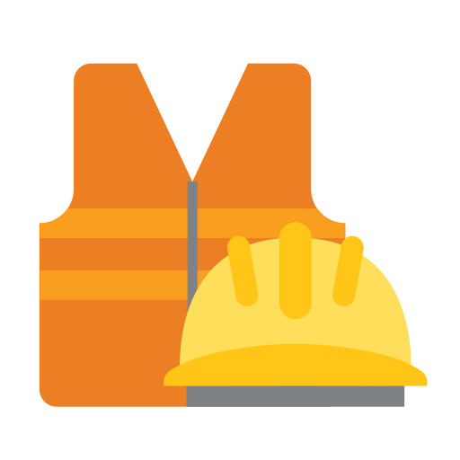

## 📚 Table of Contents
- [🐍 Python Projects](#-python-projects)
  - [🧬 Author-Curated Datasets](#-author-curated-datasets)
  - [📊 Data Analysis](#-data-analysis)
  - [💻 Python Development](#-python-development)
  
---

# 🐍 Python Projects

## 🧬 Author-Curated Datasets

| Dataset | Area | Description | Links |
|:-:|:-:|:-:|:-:|
| 
  <a href="https://www.kaggle.com/datasets/lhucastenorio/industrial-accidents-brazil-from-news-2011-2023" target="_blank"><strong>  Industrial Accidents Brazil from News 2011-2023</strong></a>
 This database refers to work accidents in Brazilian industries using press cover | Occupational Engineering and Safety |  This database was built using news articles from the G1 portal (g1.globo.com) to survey workplace accidents in Brazil between 2011 and 2023. In total, 72 news items related to workplace accidents were recorded, allowing for the extraction of several insights related to these events. |

## 📊 Data Analysis
l

l

l

l

l

l

l

l

l

l

l

l

l

l

l
## 💻 Python Development 

Projects with authoral datasets:
- MEmbrane
- DataSUS 
- Security

Other data analisis
- Students
- PLN axiv

Other projects:
- kukalib
- procmodel